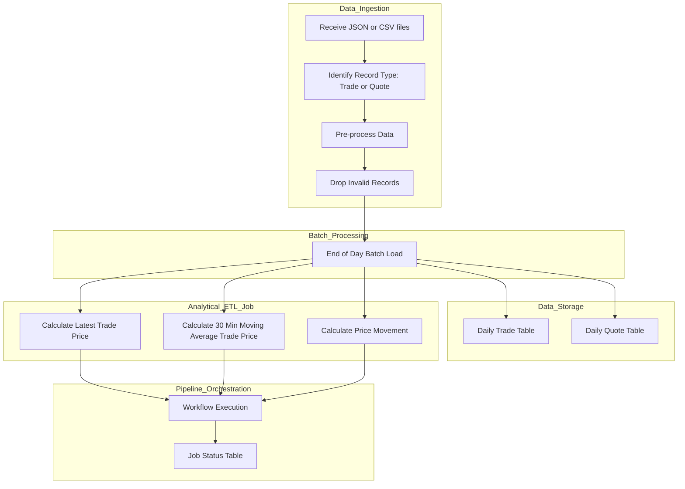

# Equity-Market-Data-Analysis

```mermaid
graph TD
subgraph Data_Ingestion
        A[Receive JSON or CSV files] --> B[Identify Record Type: Trade or Quote]
        B --> C[Pre-process Data]
        C --> D[Drop Invalid Records]
    end
subgraph Data_Storage
    E[Daily Trade Table]
    F[Daily Quote Table]
end

subgraph Batch_Processing
    G[End of Day Batch Load]
    G --> E
    G --> F
end

subgraph Analytical_ETL_Job
    H[Calculate Latest Trade Price]
    I[Calculate 30 Min Moving Average Trade Price]
    J[Calculate Price Movement]
end

subgraph Pipeline_Orchestration
    K[Workflow Execution]
    L[Job Status Table]
end

D --> G
G --> H
G --> I
G --> J
H --> K
I --> K
J --> K
K --> L
```
